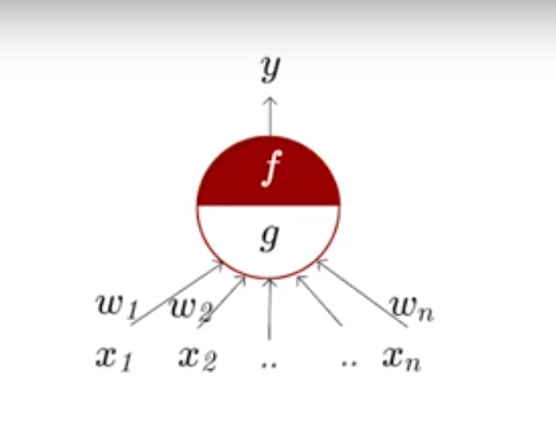

# Brief History of Deep Learning: Neuron Doctrine and the AI Winter

## Introduction

* Deep learning is a type of artificial intelligence inspired by the structure and function of the biological brain.
* "Deep learning in neural networks and overview" by Schmidhuber.

## Early Theories of the Nervous System

* The 1871 reticular theory proposed the nervous system as a continuous network. It was proposed by Joseph von Gerlach.
* Staining techniques developed in the 1870s allowed for better visualization of nervous tissues.
* Two opposing theories emerged: the neuron doctrine (discrete cells) and the reticular theory. The neuron doctrine was proposed by Santiago Ramon y Cajal.
* The term "neuron" was coined by Heinrich Wilhelm Gottfried von Waldeyer-Hartz in 1891.
* The debate lasted until the 1950s when electron microscopy confirmed the neuron doctrine.

## MucCulloch-Pitts Neuron

* The McCulloch-Pitts neuron was proposed in 1943 by Warren McCulloch and Walter Pitts.
* It was a simplified model of the biological neuron.

## The Perceptron

* The perceptron is a simplified model for decision-making processes.
* Frank Rosenblatt proposed the perceptron in 1957-58.
* Rosenblatt claimed the perceptron could learn, make decisions, and even translate languages.
* This translation claim seems strange in the context of the Cold War era's focus on machine translation.

## Early Deep Learning Ideas

* A 1957-58 article predicted computers would walk, talk, see, write, reproduce, and be conscious.
* Comparing this prediction to the current state of AI highlights the gap between hype and reality.
* Evac Nenco in 1965-68 proposed multi-layer neural networks, laying the groundwork for deep learning.

## The AI Winter

* The period from 1957 to 1969 was known as the "springtime of AI" due to high enthusiasm and funding.
* Minsky and Papert's 1969 book on the limitations of perceptrons led to the "AI winter" of reduced interest and funding.

## Universal Approximation Theorem

* This theorem states that any continuous function can be approximated by a neural network with enough hidden layers.
* This provided a theoretical foundation for using deep neural networks.
* The theorem was proven in 1989 by George Cybenko and independently by Kurt Hornik in 1991.

## Challenges in Training Deep Neural Networks

* Training deep neural networks using backpropagation can be unstable and difficult to converge.
* Limited progress was made in deep learning for about two decades due to these challenges.
